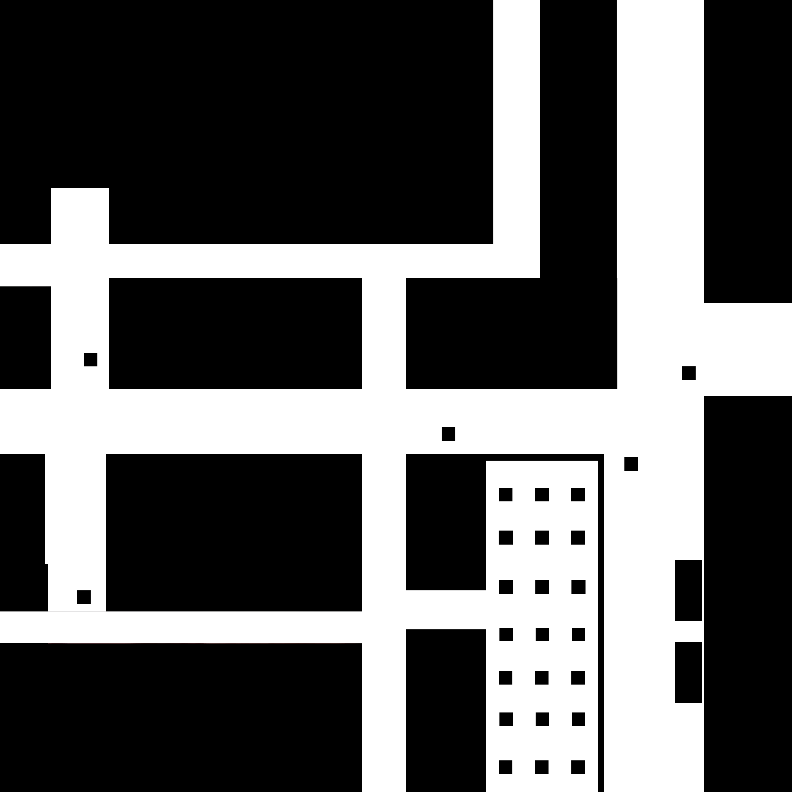
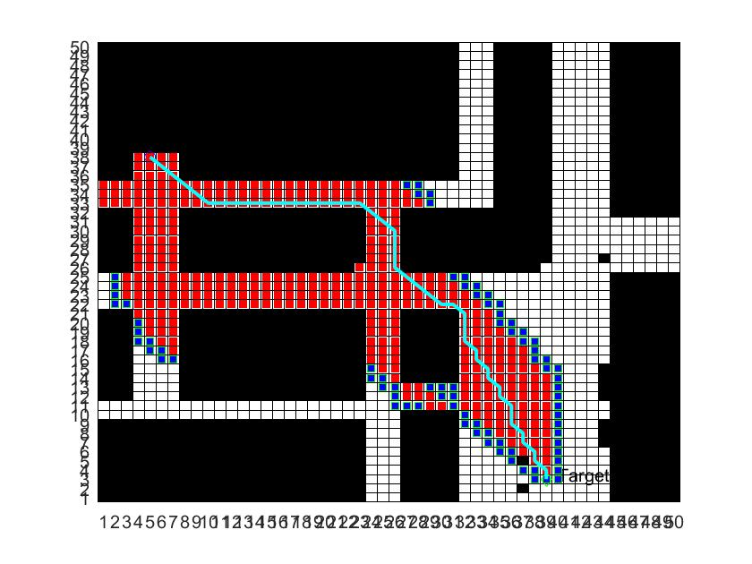

# A* Path Planning Algorithm in MATLAB

## Overview

This project implements the A* path planning algorithm in MATLAB. The algorithm is applied to a target environment represented by a monochromatic bitmap image. The project includes two main parts: generating environment data based on the bitmap and applying the A* path planning algorithm to find a feasible route.

For generating environment data, the input to the program is a monochrome bitmap which contains the obstacle information for a given environment. Black color in the graph indicates obstacles and white color indicates no obstacles. The program grids the bitmap based on a pre-set grid size parameter. The output is a two-dimensional array variable containing the obstacle information, which is the environment data that will be used by the algorithm.

This environmental data is presented by a visual interface. The start and end points are manually selected in the interactive interface and then the algorithm will plan a feasible route.

Since the increase in grid size will reduce the accuracy of the environmental data, but reduce the computation time and vice versa. This project also experimented with a series of tests to investigate a reasonable grid size, aimed at balancing between accuracy and compute time.

## Project Structure

The project directory contains the following files:

- AStar.m: Implements the A* path planning algorithm.
- CreateMap.m: Generates a grid map from a bitmap image.
- CreateMapReal(NoUsed).m: An alternative map creation function (not used).
- FindList.m: Checks if a node is in the open or closed list.
- FindObstacle.m: Identifies obstacles in the map.
- GetPath.m: Retrieves the path from the closed list.
- h.m: Heuristic function for the A* algorithm.
- isObstacle.m: Checks if a node is an obstacle.
- isopen.m: Checks if a node is in the open list.
- Main.m: Main script to run the A* algorithm.
- MotionModel.m: Defines the motion model for the algorithm.
- plot_map.m: Plots the open and closed lists during the algorithm's execution.
- SetAimPoint.m: Sets the target point on the map.
- SetStartPoint.m: Sets the start point on the map.
- README.md: This readme file.
- AStar.txt: Description of the A* algorithm.
- map.mat: Placeholder for the map data.
- point.mat: Placeholder for the start and target points.
- ResultPic: Directory containing result images.
- TestPic: Directory containing test images.

## How to Run

1. **Set Up the Environment**:
   - Ensure you have MATLAB installed on your system.
   - Place your monochromatic bitmap image in the TestPic directory.

2. **Configure Parameters**:
   - Open Main.m and set the `PicPath` variable to the path of your bitmap image.
   - Adjust other parameters such as `IfPlot`, `PlotPausetime`, `LengthofMesh`, and `FullLengthofPic` as needed.

3. **Run the Main Script**:
   - Execute Main.m in MATLAB. This script will:
     - Generate the grid map from the bitmap image.
     - Allow you to set the start and target points interactively.
     - Run the A* algorithm to find a path.
     - Plot the resulting path on the map.

## Algorithm Description

The A* algorithm works as follows:

1. **Initialization**:
   - Place the start point in the open list.

2. **Main Loop**:
   - Repeat until the goal is found or the open list is empty:
     - Sort the open list by the cost function (F = G + H).
     - Move the node with the lowest cost from the open list to the closed list.
     - For each neighboring node:
       - If it is an obstacle or in the closed list, ignore it.
       - If it is not in the open list, add it and set the current node as its parent.
       - If it is in the open list, check if the new path is better. If so, update its parent and costs.

3. **Path Retrieval**:
   - Once the goal is found, backtrack from the goal to the start using the parent pointers to retrieve the path.

## Example

To see an example of the algorithm in action, run Main.m with the provided test images in the TestPic directory. The resulting path will be displayed on the map.

### Step-by-Step Process

1. **Initial Environment**:
   - The initial environment is represented by a monochromatic bitmap image. Black areas represent obstacles, and white areas represent free space.

   

2. **Grid Map Generation**:
   - The bitmap image is converted into a grid map, which is an array data. Each cell in the grid represents a portion of the environment.

3. **Setting Start and Target Points**:
   - The start and target points are set interactively on the grid map.

4. **A\* Algorithm Execution**:
   - The A* algorithm is executed to find the shortest path from the start point to the target point.

5. **Path Retrieval and Visualization**:
   - The resulting path is retrieved and displayed on the grid map.

   

## Notes

- The grid size affects the accuracy and computation time of the algorithm. Increasing the grid size will reduce the accuracy of the environmental data but reduce the computation time, and vice versa. Experiment with different grid sizes to find a balance that works for your application.
- The project includes a visual interface for setting the start and target points, making it easy to test different scenarios.

